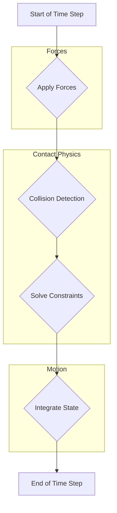

import Admonition from '@theme/Admonition';

## The Digital Twin: A Tale of Two Formats

In Module 1, we used the **Unified Robot Description Format (URDF)** to describe our robot's kinematics and visual appearance. While URDF is excellent for visualization in tools like RViz, it falls short for high-fidelity simulation. For this, we need the **Simulation Description Format (SDF)**.

### The URDF-SDF Dichotomy

Think of URDF as the robot's blueprint, defining its parts and how they connect. SDF, on the other hand, is the blueprint for an entire *world*, including the robot, lighting, environmental objects, and most importantly, the physics properties required for realistic simulation.

| Feature | URDF | SDF |
| :--- | :--- | :--- |
| **Primary Use** | Kinematic Description, Visualization (RViz) | Full Simulation Environment (Gazebo) |
| **File Type** | XML | XML |
| **Can Describe** | A single robot's structure | Entire worlds, multiple robots, lights, physics |
| **Physics Props**| Limited (mass, basic inertia) | Rich (friction, damping, contact stiffness) |
| **Looping** | No (strict tree structure) | Yes (allows for parallel manipulators) |

To use our URDF-based robot in Gazebo, we don't throw it away. Instead, we *extend* it with Gazebo-specific SDF tags within a `<gazebo>` block.

```xml title="urdf_extension_example.urdf"
<link name="left_foot">
  <!-- ... existing link properties ... -->
</link>

<!-- Gazebo-specific extensions for the 'left_foot' link -->
<gazebo reference="left_foot">
  <mu1>0.9</mu1>  <!-- Primary friction coefficient -->
  <mu2>0.9</mu2>  <!-- Secondary friction coefficient -->
  <kp>1000000.0</kp> <!-- Contact stiffness -->
  <kd>100.0</kd>     <!-- Contact damping -->
  <material>Gazebo/Grey</material>
</gazebo>
```

<Admonition type="tip" title="Personalization Tip">
  When you simulate your own robot, you will add `<gazebo>` tags to your custom URDF file to define its physical properties for interaction with the simulated world.
</Admonition>

---

## Inside the Physics Engine: Open Dynamics Engine (ODE)

Gazebo uses a physics engine to calculate the motion of objects. The default and most common engine is the **Open Dynamics Engine (ODE)**. Understanding its core components is crucial for debugging your simulation and achieving stable, realistic behavior.

### The World Update Loop

The simulation progresses in discrete time steps. Here’s a simplified view of what happens in each step:



**Key Parameters & Their Impact:**

*   **`update_rate`**: The number of simulation updates per second (Hz). A higher rate means higher fidelity but requires more CPU power.
*   **`max_step_size`**: The duration of a single time step in seconds (e.g., 0.001 for 1ms). This is the most critical parameter for stability. `update_rate * max_step_size` should equal your desired **Real Time Factor (RTF)**, which is ideally `1.0`.
*   **`iters` (Solver Iterations)**: The number of times the constraint solver (SOR-LCP) runs per time step. More iterations lead to more accurate contact physics but are computationally expensive.

<Admonition type="warning" title="Simulation Instability!">
  If your robot model "explodes" or jitters uncontrollably upon loading, the first thing to check is your physics parameters and inertial tensors. A common cause is a `max_step_size` that is too large for the complexity of the model, or inaccurate inertia values.
</Admonition>

---

## Inertial Modeling: Giving Your Robot Mass

Perhaps the most overlooked aspect of a URDF is the `<inertial>` tag. For a simulation to be stable, every link with mass must have a physically plausible **inertial tensor**.

```xml
<inertial>
  <mass value="1.5" />
  <origin xyz="0 0 0.1" rpy="0 0 0" />
  <inertia ixx="0.01" ixy="0.0" ixz="0.0"
           iyy="0.01" iyz="0.0"
           izz="0.01" />
</inertial>
```

*   **`<mass>`**: The mass of the link in kilograms.
*   **`<origin>`**: The center of mass (CoM) of the link, relative to the link's own origin.
*   **`<inertia>`**: The 3x3 inertia tensor matrix. For simple, symmetrical shapes, you only need `ixx`, `iyy`, and `izz`.

While you can approximate these for simple shapes, using CAD software (like Fusion 360, SolidWorks) to automatically calculate the mass, CoM, and inertia tensor for your links is the professional workflow.

---

## Launching the Simulation

We use a ROS 2 launch file to orchestrate starting the Gazebo server, spawning the robot, and running any necessary nodes like `robot_state_publisher`.

```python title="launch/start_simulation.launch.py"
import os
from ament_index_python.packages import get_package_share_directory
from launch import LaunchDescription
from launch.actions import IncludeLaunchDescription
from launch.launch_description_sources import PythonLaunchDescriptionSource

def generate_launch_description():
    pkg_gazebo_ros = get_package_share_directory('gazebo_ros')
    
    # Path to your custom robot description package
    pkg_robot_description = get_package_share_directory('my_robot_description')

    # Start Gazebo with a specific world file
    gazebo = IncludeLaunchDescription(
        PythonLaunchDescriptionSource(
            os.path.join(pkg_gazebo_ros, 'launch', 'gazebo.launch.py'),
        ),
        launch_arguments={'world': os.path.join(pkg_robot_description, 'worlds', 'my_world.world')}.items()
    )

    # Spawn your robot from a URDF file
    spawn_entity = Node(package='gazebo_ros', executable='spawn_entity.py',
                        arguments=['-topic', 'robot_description',
                                   '-entity', 'my_humanoid'],
                        output='screen')

    return LaunchDescription([
        gazebo,
        spawn_entity,
        # ... add other nodes like robot_state_publisher here
    ])
```
