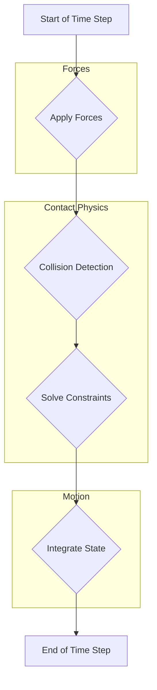
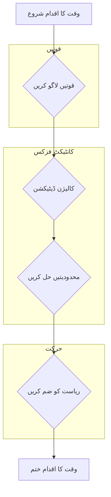

import LanguageToggle from '@site/src/components/LanguageToggle/LanguageToggle';

<LanguageToggle />
import Admonition from '@theme/Admonition';


<div className="english-content">

# Chapter 5: The Physics Engine & Gazebo

In Module 1, we used the **Unified Robot Description Format (URDF)** to describe our robot's kinematics and visual appearance. While URDF is excellent for visualization in tools like RViz, it falls short for high-fidelity simulation. For this, we need the **Simulation Description Format (SDF)**.

## 5.1 The URDF-SDF Dichotomy

Think of URDF as the robot's blueprint, defining its parts and how they connect. SDF, on the other hand, is the blueprint for an entire *world*, including the robot, lighting, environmental objects, and most importantly, the physics properties required for realistic simulation.

| Feature | URDF | SDF |
| :--- | :--- | :--- |
| **Primary Use** | Kinematic Description, Visualization (RViz) | Full Simulation Environment (Gazebo) |
| **File Type** | XML | XML |
| **Can Describe** | A single robot's structure | Entire worlds, multiple robots, lights, physics |
| **Physics Props**| Limited (mass, basic inertia) | Rich (friction, damping, contact stiffness) |
| **Looping** | No (strict tree structure) | Yes (allows for parallel manipulators) |

To use our URDF-based robot in Gazebo, we don't throw it away. Instead, we *extend* it with Gazebo-specific SDF tags within a `<gazebo>` block.

```xml title="urdf_extension_example.urdf"
<link name="left_foot">
  <!-- ... existing link properties ... -->
</link>

<!-- Gazebo-specific extensions for the 'left_foot' link -->
<gazebo reference="left_foot">
  <mu1>0.9</mu1>  <!-- Primary friction coefficient -->
  <mu2>0.9</mu2>  <!-- Secondary friction coefficient -->
  <kp>1000000.0</kp> <!-- Contact stiffness -->
  <kd>100.0</kd>     <!-- Contact damping -->
  <material>Gazebo/Grey</material>
</gazebo>
```

<Admonition type="tip" title="Personalization Tip">
  When you simulate your own robot, you will add `<gazebo>` tags to your custom URDF file to define its physical properties for interaction with the simulated world.
</Admonition>

### Inside the Physics Engine: Open Dynamics Engine (ODE)

Gazebo uses a physics engine to calculate the motion of objects. The default and most common engine is the **Open Dynamics Engine (ODE)**. Understanding its core components is crucial for debugging your simulation and achieving stable, realistic behavior.

### The World Update Loop

The simulation progresses in discrete time steps. Here’s a simplified view of what happens in each step:



**Key Parameters & Their Impact:**

*   **`update_rate`**: The number of simulation updates per second (Hz). A higher rate means higher fidelity but requires more CPU power.
*   **`max_step_size`**: The duration of a single time step in seconds (e.g., 0.001 for 1ms). This is the most critical parameter for stability. `update_rate * max_step_size` should equal your desired **Real Time Factor (RTF)**, which is ideally `1.0`.
*   **`iters` (Solver Iterations)**: The number of times the constraint solver (SOR-LCP) runs per time step. More iterations lead to more accurate contact physics but are computationally expensive.

<Admonition type="warning" title="Simulation Instability!">
  If your robot model "explodes" or jitters uncontrollably upon loading, the first thing to check is your physics parameters and inertial tensors. A common cause is a `max_step_size` that is too large for the complexity of the model, or inaccurate inertia values.
</Admonition>

## 5.2 Inertial Modeling: Giving Your Robot Mass

Perhaps the most overlooked aspect of a URDF is the `<inertial>` tag. For a simulation to be stable, every link with mass must have a physically plausible **inertial tensor**.

```xml
<inertial>
  <mass value="1.5" />
  <origin xyz="0 0 0.1" rpy="0 0 0" />
  <inertia ixx="0.01" ixy="0.0" ixz="0.0"
           iyy="0.01" iyz="0.0"
           izz="0.01" />
</inertial>
```

*   **`<mass>`**: The mass of the link in kilograms.
*   **`<origin>`**: The center of mass (CoM) of the link, relative to the link's own origin.
*   **`<inertia>`**: The 3x3 inertia tensor matrix. For simple, symmetrical shapes, you only need `ixx`, `iyy`, and `izz`.

While you can approximate these for simple shapes, using CAD software (like Fusion 360, SolidWorks) to automatically calculate the mass, CoM, and inertia tensor for your links is the professional workflow.

### Launching the Simulation

We use a ROS 2 launch file to orchestrate starting the Gazebo server, spawning the robot, and running any necessary nodes like `robot_state_publisher`.

```python title="launch/start_simulation.launch.py"
import os
from ament_index_python.packages import get_package_share_directory
from launch import LaunchDescription
from launch.actions import IncludeLaunchDescription
from launch.launch_description_sources import PythonLaunchDescriptionSource

def generate_launch_description():
    pkg_gazebo_ros = get_package_share_directory('gazebo_ros')
    
    # Path to your custom robot description package
    pkg_robot_description = get_package_share_directory('my_robot_description')

    # Start Gazebo with a specific world file
    gazebo = IncludeLaunchDescription(
        PythonLaunchDescriptionSource(
            os.path.join(pkg_gazebo_ros, 'launch', 'gazebo.launch.py'),
        ),
        launch_arguments={'world': os.path.join(pkg_robot_description, 'worlds', 'my_world.world')}.items()
    )

    # Spawn your robot from a URDF file
    spawn_entity = Node(package='gazebo_ros', executable='spawn_entity.py',
                        arguments=['-topic', 'robot_description',
                                   '-entity', 'my_humanoid'],
                        output='screen')

    return LaunchDescription([
        gazebo,
        spawn_entity,
        # ... add other nodes like robot_state_publisher here
    ])
```

</div>

<div className="urdu-content">

# باب 5: فزکس انجن اور گیزبو

ماڈیول 1 میں، ہم نے اپنے روبوٹ کے کنیمیٹکس اور بصری شکل کی وضاحت کے لیے **یونیفائیڈ روبوٹ ڈیسکرپشن فارمیٹ (URDF)** کا استعمال کیا۔ جبکہ RViz جیسے ٹولز میں وژولائزیشن کے لیے URDF بہت اچھا ہے، یہ زیادہ فیڈلٹی سیمولیشن کے لیے کم پڑ جاتا ہے۔ اس کے لیے، ہمیں **سیمولیشن ڈیسکرپشن فارمیٹ (SDF)** کی ضرورت ہے۔

## 5.1 URDF-SDF کا دوہراپن

URDF کو روبوٹ کا بلیو پرنٹ سمجھیں، جو اس کے اجزاء اور ان کے میں کیسے جڑے ہوئے ہیں کی وضاحت کرتا ہے۔ دوسری طرف، SDF پوری دنیا کا بلیو پرنٹ ہے، جس میں روبوٹ، لائٹنگ، ماحولیاتی اشیاء، اور سب سے اہم بات، حقیقی سیمولیشن کے لیے ضروری فزکس کی خصوصیات شامل ہیں۔

| خصوصیت | URDF | SDF |
| :--- | :--- | :--- |
| **بنیادی استعمال** | کنیمیٹک ڈیسکرپشن، وژولائزیشن (RViz) | مکمل سیمولیشن ماحول (Gazebo) |
| **فائل کی قسم** | XML | XML |
| **وضاحت کر سکتا ہے** | ایک روبوٹ کی ساخت | پوری دنیا، متعدد روبوٹس، لائٹس، فزکس |
| **فزکس کی خصوصیات** | محدود (ماس، بنیادی انیشیا) | غنی (مٹان، ڈیمپنگ، کانٹیکٹ سٹفنس) |
| **لوپنگ** | نہیں (سخت ٹری ساخت) | ہاں (پیرالل مینیپولیٹرز کی اجازت دیتا ہے) |

Gazebo میں اپنے URDF-مبنی روبوٹ کو استعمال کرنے کے لیے، ہم اسے نہیں چھوڑتے۔ بجائے اس کے، ہم اسے `<gazebo>` بلاک کے اندر Gazebo-مخصوص SDF ٹیگز کے ساتھ *توسیع* دیتے ہیں۔

```xml title="urdf_extension_example.urdf"
<link name="left_foot">
  <!-- ... موجودہ لنک کی خصوصیات ... -->
</link>

<!-- 'left_foot' لنک کے لیے گیزبو-مخصوص توسیعات -->
<gazebo reference="left_foot">
  <mu1>0.9</mu1>  <!-- بنیادی مٹان کا کوائف -->
  <mu2>0.9</mu2>  <!-- ثانوی مٹان کا کوائف -->
  <kp>1000000.0</kp> <!-- کانٹیکٹ سٹفنس -->
  <kd>100.0</kd>     <!-- کانٹیکٹ ڈیمپنگ -->
  <material>Gazebo/Grey</material>
</gazebo>
```

<Admonition type="tip" title="ذاتی کارکردگی کا مشورہ">
  جب آپ اپنے روبوٹ کو سیمولیٹ کریں گے، تو آپ اس کے سیمولیٹڈ دنیا کے ساتھ تعامل کے لیے اس کی جسمانی خصوصیات کی وضاحت کرنے کے لیے اپنی حسب ضرورت URDF فائل میں `<gazebo>` ٹیگز شامل کریں گے۔
</Admonition>

### فزکس انجن کے اندر: اوپن ڈائنا مکس انجن (ODE)

گیزبو اشیاء کی حرکت کا حساب لگانے کے لیے ایک فزکس انجن کا استعمال کرتا ہے۔ ڈیفالٹ اور سب سے عام انجن **اوپن ڈائنا مکس انجن (ODE)** ہے۔ اس کے بنیادی اجزاء کو سمجھنا آپ کی سیمولیشن کو ڈیبگ کرنے اور مستحکم، حقیقی طرز عمل حاصل کرنے کے لیے انتہائی ضروری ہے۔

### دنیا کا اپ ڈیٹ لوپ

سیمولیشن میں وقت کے منقطع اقدامات میں ترقی ہوتی ہے۔ ہر اقدام میں یہ ہوتا ہے:



**اہم پیرامیٹرز اور ان کا اثر:**

*   **`update_rate`**: فی سیکنڈ سیمولیشن اپ ڈیٹس کی تعداد (Hz)۔ زیادہ ریٹ کا مطلب زیادہ فیڈلٹی لیکن زیادہ CPU طاقت کی ضرورت ہوتی ہے۔
*   **`max_step_size`**: سیکنڈوں میں ایک وقت کے اقدام کی مدت (مثلاً 0.001 برائے 1ms)۔ یہ استحکام کے لیے سب سے اہم پیرامیٹر ہے۔ `update_rate * max_step_size` آپ کے مطلوبہ **ریل ٹائم فیکٹر (RTF)** کے برابر ہونا چاہیے، جو مثالی طور پر `1.0` ہونا چاہیے۔
*   **`iters` (حل کنندہ تکراریں)**: ہر وقت کے اقدام پر قید حل کنندہ (SOR-LCP) کتنی بار چلتا ہے۔ زیادہ تکراریں زیادہ درست کانٹیکٹ فزکس کا نتیجہ دیتی ہیں لیکن کمپیوٹیشنل طور پر مہنگا ہے۔

<Admonition type="warning" title="سیمولیشن عدم استحکام!">
  اگر آپ کا روبوٹ ماڈل لوڈ ہونے پر "پھٹ" جاتا ہے یا غیر معمولی طور پر جھومنے لگتا ہے، تو پہلا چیک کرنا فزکس پیرامیٹرز اور انیشیا ٹینسرز ہے۔ ایک عام وجہ ایک `max_step_size` ہے جو ماڈل کی پیچیدگی کے لیے بہت بڑا ہے، یا غلط انیشیا ویلیوز ہیں۔
</Admonition>

## 5.2 انیشل ماڈلنگ: آپ کے روبوٹ کو ماس دینا

URDF کا شاید سب سے زیادہ نظر انداز کیا گیا پہلو `<inertial>` ٹیگ ہے۔ کسی سیمولیشن کے مستحکم ہونے کے لیے، ہر لنک جس میں ماس ہو اس کے پاس جسمانی طور پر قابلِ قبول **انیشل ٹینسر** ہونا چاہیے۔

```xml
<inertial>
  <mass value="1.5" />
  <origin xyz="0 0 0.1" rpy="0 0 0" />
  <inertia ixx="0.01" ixy="0.0" ixz="0.0"
           iyy="0.01" iyz="0.0"
           izz="0.01" />
</inertial>
```

*   **`<mass>`**: کلو گرام میں لنک کا وزن۔
*   **`<origin>`**: لنک کا مرکزِ ماس (CoM)، لنک کے اپنے اصل کے مقابلے میں۔
*   **`<inertia>`**: 3x3 انیشل ٹینسر میٹرکس۔ سادہ، متوازن شکلوں کے لیے، آپ کو صرف `ixx`, `iyy`, اور `izz` کی ضرورت ہے۔

جیسا کہ آپ اسے سادہ شکلوں کے لیے تقرب کر سکتے ہیں، اپنے لنکس کے لیے ماس، CoM، اور انیشل ٹینسر کو خود بخود حساب لگانے کے لیے CAD سافٹ ویئر (جیسے فیوژن 360، سولڈ ورکس) کا استعمال پیشہ ورانہ کام کا طریقہ ہے۔

### سیمولیشن شروع کرنا

ہم Gazebo سرور شروع کرنا، روبوٹ کو اسپون کرنا، اور `robot_state_publisher` جیسے ضروری نوڈز کو چلانے کو منظم کرنے کے لیے ایک ROS 2 لانچ فائل کا استعمال کرتے ہیں۔

```python title="launch/start_simulation.launch.py"
import os
from ament_index_python.packages import get_package_share_directory
from launch import LaunchDescription
from launch.actions import IncludeLaunchDescription
from launch.launch_description_sources import PythonLaunchDescriptionSource

def generate_launch_description():
    pkg_gazebo_ros = get_package_share_directory('gazebo_ros')

    # آپ کے حسب ضرورت روبوٹ ڈیسکرپشن پیکج کا راستہ
    pkg_robot_description = get_package_share_directory('my_robot_description')

    # ایک مخصوص دنیا کی فائل کے ساتھ Gazebo شروع کریں
    gazebo = IncludeLaunchDescription(
        PythonLaunchDescriptionSource(
            os.path.join(pkg_gazebo_ros, 'launch', 'gazebo.launch.py'),
        ),
        launch_arguments={'world': os.path.join(pkg_robot_description, 'worlds', 'my_world.world')}.items()
    )

    # URDF فائل سے اپنا روبوٹ اسپون کریں
    spawn_entity = Node(package='gazebo_ros', executable='spawn_entity.py',
                        arguments=['-topic', 'robot_description',
                                   '-entity', 'my_humanoid'],
                        output='screen')

    return LaunchDescription([
        gazebo,
        spawn_entity,
        # ... یہاں دیگر نوڈز جیسے robot_state_publisher شامل کریں
    ])
```

</div>
