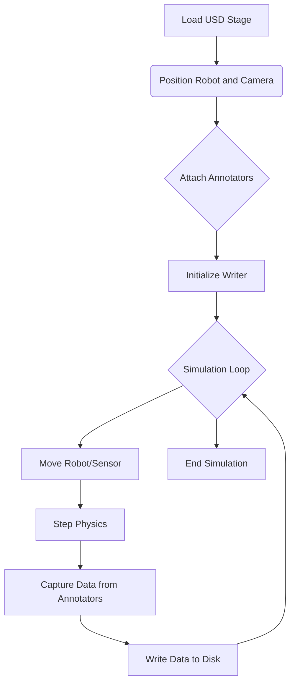

import Admonition from '@theme/Admonition';

### Mission Briefing

Your first mission in building the AI brain is to construct a "digital sanctuary"—a training ground for our AI. We will move beyond basic physics into the realm of photorealistic, physically-accurate environments using **NVIDIA Isaac Sim**. Your goal is to create a world so realistic that the data it generates can be used to train robust perception algorithms, effectively giving our robot a place to learn and dream.

### Key Learning Objectives

*   Architect a complete, photorealistic simulation environment in Isaac Sim.
*   Master the Universal Scene Description (USD) format for composing complex scenes.
*   Implement a synthetic data generation pipeline to produce labeled datasets (RGB, depth, segmentation).

---

## The Isaac Sim Architecture

Isaac Sim is more than just a simulator; it's a platform built on **NVIDIA Omniverse™**. It leverages the component-based architecture of the Omniverse Kit SDK and uses **PhysX 5** for physics, offering a significant fidelity upgrade over Gazebo's default ODE engine.

| Feature | Gazebo (Module 2) | Isaac Sim (Module 3) |
| :--- | :--- | :--- |
| **Rendering** | Rasterization (OpenGL) | Real-time Ray Tracing & Path Tracing |
| **Physics Engine**| ODE (Default) | PhysX 5 |
| **Scene Format** | SDF | Universal Scene Description (USD) |
| **Primary Language**| C++ (Plugins) | Python |
| **Key Use Case** | Fast, non-photoreal physics simulation | Photorealistic, physically-accurate simulation & synthetic data |

### Universal Scene Description (USD)

At the heart of Isaac Sim and Omniverse is USD. It's a powerful framework for describing, composing, and collaborating on 3D scenes. Think of it not as a file format, but as a complex scene graph.

*   **Prims (Primitives):** The basic building blocks of a scene (e.g., a mesh, a camera, a light).
*   **Layers:** Changes to a scene are stored in layers. You can non-destructively edit a complex scene by adding a new layer on top of existing ones.
*   **Composition:** USD can combine many different assets and layers into a single, coherent scene.

---

## Mission 1: Synthetic Data Generation

A primary use case for Isaac Sim is generating perfect, pixel-level labeled data to train AI models. We will create a simple script to have the robot look around a room and save RGB images and their corresponding semantic segmentation masks.

### The SDG Pipeline

The process involves setting up the scene, attaching annotators to a camera, and running a script to capture data.



### Practical Implementation

**1. Scene Setup:**
First, we load our robot's URDF into Isaac Sim. Isaac Sim has a built-in URDF Importer that converts the model to USD. We then place it in a pre-built environment, like the `simple_room.usd`, and adjust the lighting and materials for realism.

<Admonition type="tip" title="Personalization Tip">
  The URDF Importer settings allow you to choose between `Rigidbody` and `ArticulationBody`. For a humanoid, always choose **ArticulationBody** for stable physics. You will point the importer to your own robot's URDF file.
</Admonition>

**2. Python Scripting:**
We control the simulation using Python scripts. The following script demonstrates the complete SDG workflow.

```python title="generate_data.py"
import omni
from omni.isaac.core import World
from omni.isaac.core.objects import VisualCuboid
from omni.isaac.core.utils.nucleus import get_assets_root_path
from omni.isaac.core.utils.prims import create_prim
from omni.isaac.synthetic_utils import SyntheticDataHelper
import numpy as np

# --- Simulation Setup ---
world = World()
# Add a cube to the scene
world.scene.add(
    VisualCuboid(
        prim_path="/World/random_cube",
        position=np.array([0, 0, 0.5]),
        size=0.2,
        color=np.array([255, 0, 0]),
    )
)
# Reset the world to a clean state
world.reset()

# --- SDG Setup ---
sdh = SyntheticDataHelper()
# Create a camera
create_prim("/World/Camera", "Camera")
# Attach annotators
sdh.initialize(["rgb", "semantic_segmentation"], "/World/Camera")

# --- Simulation Loop ---
for i in range(100):
    # Move the cube randomly
    world.scene.get_object("random_cube").set_world_pose(
        position=np.random.rand(3) * 0.5
    )
    # Step the simulation
    world.step(render=True)
    # Capture data
    if i % 10 == 0:
        sdh.get_groundtruth(
            {
                "rgb": "rgb_data.png",
                "semantic_segmentation": "segmentation_data.png"
            },
            f"output_frame_{i}.png"
        )

# --- Cleanup ---
world.stop()
```

<Admonition type="info" icon="💡" title="Hardware Focus: RTX 4070 Ti Optimization">
  To ensure a smooth viewport experience and fast data generation in Isaac Sim with an **NVIDIA RTX 4070 Ti**:
  *   **Rendering Mode:** Use the **Real-Time** path tracer for interactive use. For final data generation, you can switch to the **Path-Traced** mode for higher quality.
  *   **Samples per Pixel:** In `Render Settings > Real-Time`, keep the `Samples per Pixel per Frame` low (e.g., 4-8) for interactivity.
  *   **Denoising:** Ensure the AI Denoiser is enabled. It uses the Tensor Cores on your RTX GPU to produce a clean image from noisy, low-sample renders, dramatically improving performance.
</Admonition>
