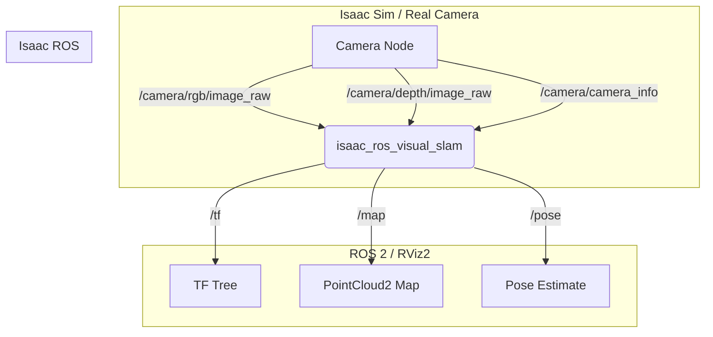

import Admonition from '@theme/Admonition';

### Mission Briefing

A brain is useless without senses. In this mission, you will give your robot the ability to simultaneously **build a map of its environment and track its own position within it**—a process known as Visual SLAM (Simultaneous Localization and Mapping). You will implement a state-of-the-art VSLAM system using **Isaac ROS**, leveraging your GPU to achieve real-time performance that would be impossible on a CPU alone.

### Key Learning Objectives

*   Understand and implement a full Visual SLAM pipeline.
*   Integrate and configure hardware-accelerated ROS 2 packages ("Gems").
*   Analyze and benchmark the performance difference between CPU and GPU-based robotics algorithms.

---

## Why Hardware Acceleration is a Game-Changer

Traditional robotics algorithms, especially in perception, often run on the CPU. However, processing high-volume data streams like 60 FPS camera feeds is computationally intensive. A CPU can quickly become a bottleneck, leading to delayed or dropped measurements and, ultimately, a lost and confused robot.

By offloading these parallelizable tasks to a GPU, we can process data much faster, leading to more accurate and robust real-time performance. This is the core principle of the Isaac ROS stack.

## The Isaac ROS VSLAM Gem

NVIDIA provides a suite of hardware-accelerated ROS 2 packages called "Gems." The `isaac_ros_visual_slam` package is a standout example. It takes in synchronized RGB-D camera data and outputs the robot's real-time pose estimate and a map of the environment.

### VSLAM ROS 2 Graph

The data flow is a pipeline of nodes communicating over topics. Your camera node (from Isaac Sim or a real camera) publishes images, the VSLAM node consumes them, and RViz2 visualizes the outputs.



---

## Mission 2: Building the Map

Let's implement the VSLAM pipeline.

### 1. Launching the VSLAM Node

You will create a ROS 2 launch file to start the `isaac_ros_visual_slam` node and remap the topics to match your camera's output.

```python title="launch/vslam.launch.py"
import os
from launch import LaunchDescription
from launch_ros.actions import Node
from launch.actions import DeclareLaunchArgument
from launch.substitutions import LaunchConfiguration

def generate_launch_description():
    # Declare launch arguments for remapping
    rgb_topic = LaunchConfiguration('rgb_topic', default='/camera/rgb/image_raw')
    depth_topic = LaunchConfiguration('depth_topic', default='/camera/depth/image_raw')
    camera_info_topic = LaunchConfiguration('camera_info_topic', default='/camera/camera_info')

    return LaunchDescription([
        DeclareLaunchArgument('rgb_topic', default_value=rgb_topic),
        DeclareLaunchArgument('depth_topic', default_value=depth_topic),
        DeclareLaunchArgument('camera_info_topic', default_value=camera_info_topic),
        
        Node(
            package='isaac_ros_visual_slam',
            executable='isaac_ros_visual_slam',
            name='visual_slam_node',
            output='screen',
            parameters=[{
                'use_sim_time': True,
                # Add other VSLAM parameters here from a YAML file
            }],
            remappings=[
                ('stereo_camera/left/image', rgb_topic),
                ('stereo_camera/left/camera_info', camera_info_topic),
                ('stereo_camera/depth', depth_topic)
            ]
        )
    ])
```

<Admonition type="tip" title="Personalization Tip">
  To use this with your own robot, you simply need to change the `default` values of the `rgb_topic`, `depth_topic`, and `camera_info_topic` to match the topics your robot's camera publishes.
</Admonition>

### 2. Visualizing in RViz2

To see the results, you will configure RViz2:
1.  Set the "Global Options" `Fixed Frame` to `odom`.
2.  Add the `TF` display to see the robot's pose tree.
3.  Add a `PointCloud2` display and set the topic to `/map` to see the map being built.
4.  Add a `Pose` display and set the topic to `/pose` to see the current pose estimate.

As you drive your robot around in Isaac Sim, you should see the map grow in RViz2 in real-time.

---

## Hardware Focus: The CPU vs. GPU Showdown

This exercise will give you a visceral understanding of hardware acceleration.

1.  **Run CPU-based SLAM:** First, launch a well-known CPU-based SLAM package like `rtabmap_ros`. While it runs, open a terminal and run `htop`. You will see several of your CPU cores spike to 80-100% utilization.
2.  **Run Isaac ROS VSLAM:** Now, stop the CPU SLAM and launch your `vslam.launch.py` file. While it's running, open two terminals:
    *   In the first, run `htop`. You will notice your CPU usage is significantly lower.
    *   In the second, run `watch -n 1 nvidia-smi`. You will see the `isaac_ros_visual_slam` process appear and GPU utilization climb.

**Conclusion:** The `isaac_ros_visual_slam` node offloads the heavy computation to the **CUDA cores on your RTX 4070 Ti**, freeing up the CPU for other critical tasks like path planning or running AI models. This is the power of a hardware-accelerated robotics stack.
