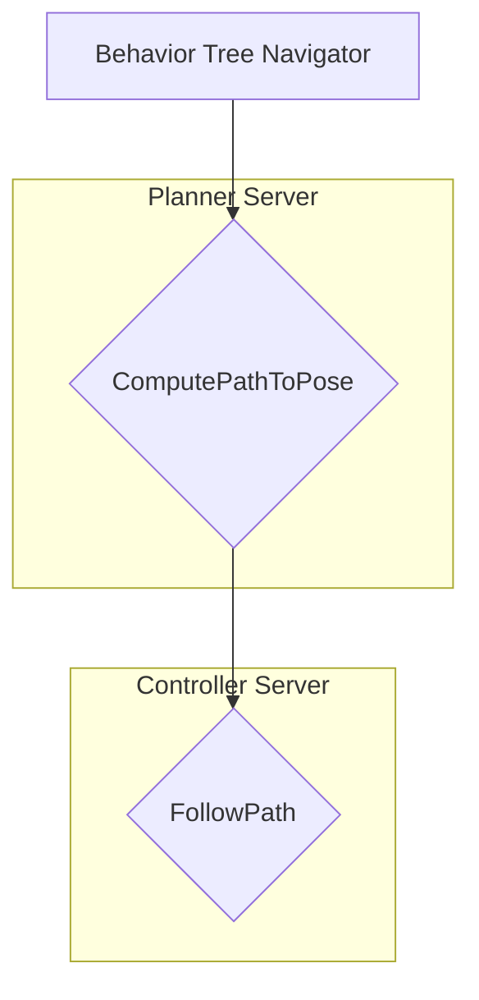

import Admonition from '@theme/Admonition';

### Mission Briefing

Your robot can see and map its world. But can it move with purpose? This final, advanced mission challenges you to adapt the industry-standard navigation stack, **Nav2**, for a bipedal humanoid. You will learn why algorithms designed for wheeled robots fail for legged systems and implement a custom controller to bridge the gap between high-level planning and low-level walking.

### Key Learning Objectives

*   Critically analyze the limitations of standard navigation algorithms for legged robots.
*   Understand the detailed architecture of the Nav2 stack.
*   Develop and integrate a custom controller plugin for Nav2.

---

## Wheeled vs. Legged: A Tale of Two Robots

The default Nav2 stack is brilliant... for robots with wheels. It assumes the robot is a "kinematic car" that can be controlled by a `geometry_msgs/Twist` message, which specifies linear (forward/backward) and angular (turning) velocities.

**This assumption breaks down for a humanoid:**
*   A humanoid cannot move at any arbitrary `(x, y, z)` velocity. It moves in discrete steps.
*   Turning is not instantaneous; it requires a sequence of steps.
*   The robot's "footprint" is not a static circle or square; it's a dynamic shape that changes with every step.

Sending a `cmd_vel` to a walking controller is like telling a person "move forward at 1.5 m/s and turn at 0.4 rad/s." This is unnatural. We need to command the robot in a way it understands: by telling it where to step.

---

## Deconstructing the Nav2 Stack

To modify Nav2, we must first understand its architecture. Nav2 is a highly modular system managed by a Behavior Tree. For our purposes, the most important part is the **Controller Server**.



The `FollowPath` behavior is where the magic happens. It takes the global path from the Planner and passes it to a selected **Controller Plugin**. The default plugin (e.g., DWB) calculates a `cmd_vel`. Our mission is to replace this plugin.

### The Planner/Controller Workflow

This is the core loop of Nav2's `FollowPath` behavior.

```
+--------------------------+
|  Global Path from Planner|
|  (e.g., A* or Smac)      |
+-------------+------------+
              |
              v
+-------------+------------+
|   Controller Server      |
| (FollowPath Behavior)    |
+-------------+------------+
              |
              v
+-------------+------------+
|   Custom Bipedal         |
|   Controller Plugin      |
|                          |
| 1. Receives global path. |
| 2. Finds its current pose.|
| 3. Computes the *next*   |
|    logical step to take. |
+-------------+------------+
              |
              v
+-------------+------------+
|  Publishes Custom Msg    |
| (humanoid_nav_msgs/Step) |
+--------------------------+
              |
              v
+--------------------------+
|  Low-Level Walking       |
|  Controller (Future Mod.)|
+--------------------------+

```

---

## Mission 3: Building a Custom Bipedal Controller

We will create a simplified controller in Python that publishes custom "step" commands instead of `cmd_vel`.

### 1. Define the Command Message

First, we create a new message package (`humanoid_nav_msgs`) with a `StepCommand.msg` file.

```ros2-msg title="humanoid_nav_msgs/msg/StepCommand.msg"
# A command to take one or more steps
string command_id   # e.g., "forward", "turn_left", "strafe_right"
uint32 number_of_steps
```

### 2. The Python Controller Plugin

This Python class will be registered as a Nav2 plugin. It receives the global path and computes a very simple command.

```python title="bipedal_controller/controller.py"
import rclpy
from nav2_core.controller import Controller
from humanoid_nav_msgs.msg import StepCommand

class BipedalController(Controller):
    def configure(self, parent, name, tf, costmap_ros):
        # Initialize the node and publisher
        self._node = parent
        self._plugin_name = name
        self._publisher = self._node.create_publisher(StepCommand, "/bipedal_step_command", 10)
        # ... other initializations ...

    def setPlan(self, path):
        # Store the path received from the planner
        self._global_plan = path

    def computeVelocityCommands(self, pose, velocity, goal_checker):
        # This is the main loop
        # For simplicity, we'll just look at the next point on the path
        # and issue a "forward" command if it's far enough away.
        # A real controller would be much more complex.

        if self._is_goal_reached():
            return None # Stop

        step_msg = StepCommand()
        step_msg.command_id = "forward"
        step_msg.number_of_steps = 1
        
        self._publisher.publish(step_msg)

        # We don't return a Twist, as we're not a velocity-based controller
        return None 
```

### 3. Configuration and Registration

**a) Register the Plugin:** You modify `setup.py` in your Python package to register `bipedal_controller.controller:BipedalController` as a `nav2_core.controller` plugin.

**b) Configure Nav2:** You create a YAML file telling Nav2's controller server to use your new plugin.

```yaml title="nav2_params.yaml"
controller_server:
  ros__parameters:
    use_sim_time: True
    controller_plugins: ["FollowPath"]
    FollowPath:
      plugin: "your_ros2_pkg::BipedalController" # The name you registered
      # ... other parameters for your plugin ...
```

When you launch Nav2 with this configuration, clicking a goal in RViz will cause your `BipedalController` to be called, and you'll see `StepCommand` messages being published.

<Admonition type="caution" icon="⚙️" title="Hardware Focus: CPU is King for Planning">
  While VSLAM leaned on the GPU, path planning is a different story. The algorithms used by Nav2's planners (like Smac Planner, which uses A*) are sequential and CPU-bound. A high-core-count CPU with good single-threaded performance is critical for reducing the time it takes to compute a complex global path. You can use tools like `gprof` or even simple timing logs within the C++ source code of Nav2 to profile and understand which planning heuristics are most expensive.
</Admonition>
