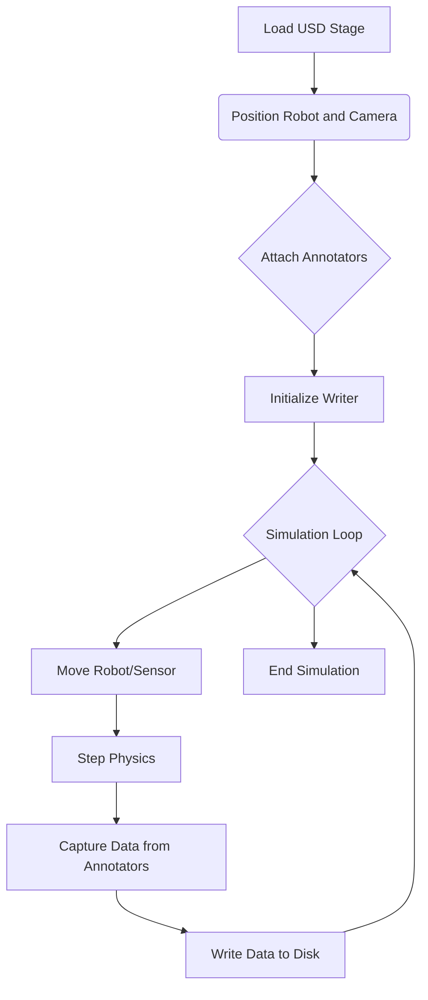

import Admonition from '@theme/Admonition';
import LanguageToggle from '@site/src/components/LanguageToggle/LanguageToggle';

<LanguageToggle />


<div className="english-content">

# Chapter 11: The Sentient Simulator (NVIDIA Isaac Sim)

Your first mission in building the AI brain is to construct a "digital sanctuary"—a training ground for our AI. We will move beyond basic physics into the realm of photorealistic, physically-accurate environments using **NVIDIA Isaac Sim**. Your goal is to create a world so realistic that the data it generates can be used to train robust perception algorithms, effectively giving our robot a place to learn and dream.

### Key Learning Objectives

*   Architect a complete, photorealistic simulation environment in Isaac Sim.
*   Master the Universal Scene Description (USD) format for composing complex scenes.
*   Implement a synthetic data generation pipeline to produce labeled datasets (RGB, depth, segmentation).

## 11.1 The Isaac Sim Architecture

Isaac Sim is more than just a simulator; it's a platform built on **NVIDIA Omniverse™**. It leverages the component-based architecture of the Omniverse Kit SDK and uses **PhysX 5** for physics, offering a significant fidelity upgrade over Gazebo's default ODE engine.

| Feature | Gazebo (Module 2) | Isaac Sim (Module 3) |
| :--- | :--- | :--- |
| **Rendering** | Rasterization (OpenGL) | Real-time Ray Tracing & Path Tracing |
| **Physics Engine**| ODE (Default) | PhysX 5 |
| **Scene Format** | SDF | Universal Scene Description (USD) |
| **Primary Language**| C++ (Plugins) | Python |
| **Key Use Case** | Fast, non-photoreal physics simulation | Photorealistic, physically-accurate simulation & synthetic data |

### Universal Scene Description (USD)

At the heart of Isaac Sim and Omniverse is USD. It's a powerful framework for describing, composing, and collaborating on 3D scenes. Think of it not as a file format, but as a complex scene graph.

*   **Prims (Primitives):** The basic building blocks of a scene (e.g., a mesh, a camera, a light).
*   **Layers:** Changes to a scene are stored in layers. You can non-destructively edit a complex scene by adding a new layer on top of existing ones.
*   **Composition:** USD can combine many different assets and layers into a single, coherent scene.

## 11.2 Mission 1: Synthetic Data Generation

A primary use case for Isaac Sim is generating perfect, pixel-level labeled data to train AI models. We will create a simple script to have the robot look around a room and save RGB images and their corresponding semantic segmentation masks.

### The SDG Pipeline

The process involves setting up the scene, attaching annotators to a camera, and running a script to capture data.



### Practical Implementation

**1. Scene Setup:**
First, we load our robot's URDF into Isaac Sim. Isaac Sim has a built-in URDF Importer that converts the model to USD. We then place it in a pre-built environment, like the `simple_room.usd`, and adjust the lighting and materials for realism.

<Admonition type="tip" title="Personalization Tip">
  The URDF Importer settings allow you to choose between `Rigidbody` and `ArticulationBody`. For a humanoid, always choose **ArticulationBody** for stable physics. You will point the importer to your own robot's URDF file.
</Admonition>

**2. Python Scripting:**
We control the simulation using Python scripts. The following script demonstrates the complete SDG workflow.

```python title="generate_data.py"
import omni
from omni.isaac.core import World
from omni.isaac.core.objects import VisualCuboid
from omni.isaac.core.utils.nucleus import get_assets_root_path
from omni.isaac.core.utils.prims import create_prim
from omni.isaac.synthetic_utils import SyntheticDataHelper
import numpy as np

# --- Simulation Setup ---
world = World()
# Add a cube to the scene
world.scene.add(
    VisualCuboid(
        prim_path="/World/random_cube",
        position=np.array([0, 0, 0.5]),
        size=0.2,
        color=np.array([255, 0, 0]),
    )
)
# Reset the world to a clean state
world.reset()

# --- SDG Setup ---
sdh = SyntheticDataHelper()
# Create a camera
create_prim("/World/Camera", "Camera")
# Attach annotators
sdh.initialize(["rgb", "semantic_segmentation"], "/World/Camera")

# --- Simulation Loop ---
for i in range(100):
    # Move the cube randomly
    world.scene.get_object("random_cube").set_world_pose(
        position=np.random.rand(3) * 0.5
    )
    # Step the simulation
    world.step(render=True)
    # Capture data
    if i % 10 == 0:
        sdh.get_groundtruth(
            {
                "rgb": "rgb_data.png",
                "semantic_segmentation": "segmentation_data.png"
            },
            f"output_frame_{i}.png"
        )

# --- Cleanup ---
world.stop()
```

<Admonition type="info" icon="💡" title="Hardware Focus: RTX 4070 Ti Optimization">
  To ensure a smooth viewport experience and fast data generation in Isaac Sim with an **NVIDIA RTX 4070 Ti**:
  *   **Rendering Mode:** Use the **Real-Time** path tracer for interactive use. For final data generation, you can switch to the **Path-Traced** mode for higher quality.
  *   **Samples per Pixel:** In `Render Settings > Real-Time`, keep the `Samples per Pixel per Frame` low (e.g., 4-8) for interactivity.
  *   **Denoising:** Ensure the AI Denoiser is enabled. It uses the Tensor Cores on your RTX GPU to produce a clean image from noisy, low-sample renders, dramatically improving performance.
</Admonition>


</div>

<div className="urdu-content">

# باب 11: شعور والے سیمولیٹر (NVIDIA Isaac Sim)

AI دماغ کی تعمیر میں آپ کا پہلا مشن "ڈیجیٹل پناہ گاہ" تخلیق کرنا ہے—ہمارے AI کے لیے ایک تربیتی میدان۔ ہم بنیادی فزکس سے آگے بڑھ کر فوٹو ریل سٹک، جسمانی طور پر درست ماحول کی دنیا میں جائیں گے جس کے لیے **NVIDIA Isaac Sim** کا استعمال کریں گے۔ آپ کا مقصد اتنا حقیقی دنیا تخلیق کرنا ہے کہ اس سے پیدا ہونے والے ڈیٹا کو مضبوط ادراک الگورتھم کی تربیت کے لیے استعمال کیا جا سکے، مؤثر طور پر ہمارے روبوٹ کو ایک جگہ دینا کہ وہاں سیکھنے اور خواب دیکھنے کا موقع ہو۔

### کلیدی سیکھنے کے اہداف

*   Isaac Sim میں ایک مکمل، فوٹو ریل سٹک سیمولیشن ماحول کی تعمیر کریں۔
*   پیچیدہ مناظر کو مرتب کرنے کے لیے یونیورسل سین ڈیسکرپشن (USD) فارمیٹ کا ماہر بنیں۔
*   لیبل والے ڈیٹا سیٹس (RGB، ڈیپتھ، سیگمینٹیشن) پیدا کرنے کے لیے ایک مصنوعی ڈیٹا جنریشن پائپ لائن نافذ کریں۔

## 11.1 Isaac Sim کی معماری

Isaac Sim صرف ایک سیمولیٹر سے زیادہ ہے؛ یہ **NVIDIA Omniverse™** پر تعمیر کیا گیا ایک پلیٹ فارم ہے۔ یہ Omniverse Kit SDK کے کمپوننٹ-مبنی معماری کا فائدہ اٹھاتا ہے اور فزکس کے لیے **PhysX 5** کا استعمال کرتا ہے، Gazebo کے ڈیفالٹ ODE انجن کے مقابلے میں قابلِ قدر وفاداری میں اضافہ فراہم کرتا ہے۔

| خصوصیت | Gazebo (ماڈیول 2) | Isaac Sim (ماڈیول 3) |
| :--- | :--- | :--- |
| **رینڈرنگ** | ریسٹرائزیشن (OpenGL) | حقیقی وقت کا رے ٹریسنگ اور پاتھ ٹریسنگ |
| **فزکس انجن** | ODE (ڈیفالٹ) | PhysX 5 |
| **منظر فارمیٹ** | SDF | یونیورسل سین ڈیسکرپشن (USD) |
| **اولین زبان** | C++ (پلگ انز) | Python |
| **اہم کام کا مقصد** | تیز، غیر فوٹو ریل سٹک فزکس سیمولیشن | فوٹو ریل سٹک، جسمانی طور پر درست سیمولیشن اور مصنوعی ڈیٹا |

### یونیورسل سین ڈیسکرپشن (USD)

Isaac Sim اور Omniverse کے دل میں USD ہے۔ یہ 3D مناظر کو تفصیل دینے، مرتب کرنے، اور اس پر تعاون کرنے کے لیے ایک طاقتور فریم ورک ہے۔ اسے ایک فائل فارمیٹ کے بجائے ایک پیچیدہ سین گراف کے طور پر سمجھیں۔

*   **Prims (Primitive):** منظر کے بنیادی ٹکڑے (مثلاً ایک میش، ایک کیمرا، ایک لائٹ)۔
*   **لیئرز:** منظر میں تبدیلیاں لیئرز میں محفوظ کی جاتی ہیں۔ آپ موجودہ لیئرز کے اوپر ایک نیا لیئر شامل کر کے ایک پیچیدہ منظر کو غیر تخریبی طور پر ایڈیٹ کر سکتے ہیں۔
*   **کمپوزیشن:** USD کئی مختلف اثاثوں اور لیئرز کو ایک واحد، منطقی منظر میں جمع کر سکتا ہے۔

## 11.2 مشن 1: مصنوعی ڈیٹا جنریشن

Isaac Sim کا ایک اہم کام کا مقصد AI ماڈلز کی تربیت کے لیے مکمل، پکسل-لیول لیبل والے ڈیٹا کو پیدا کرنا ہے۔ ہم ایک سادہ اسکرپٹ تخلیق کریں گے تاکہ روبوٹ ایک کمرے کے ارد گرد دیکھ سکے اور RGB امیجز اور ان کے مطابق سیمینٹک سیگمینٹیشن ماسکس کو محفوظ کر سکے۔

### SDG پائپ لائن

اس کا عمل منظر کو سیٹ کرنا، ایک کیمرہ سے اینوٹیٹرز منسلک کرنا، اور ڈیٹا کو قبضہ کرنے کے لیے ایک اسکرپٹ چلانا شامل ہے۔

```mermaid
graph TD
    A[USD اسٹیج لوڈ کریں] --> B[روبوٹ اور کیمرہ کی جگہ]:
    B --> C{اینوٹیٹرز منسلک کریں};
    C --> D[رائٹر شروع کریں];
    D --> E{سیمولیشن لوپ};
    E --> F[روبوٹ/سینسر حرکت دیں];
    F --> G[فزکس کا قدم];
    G --> H[اینوٹیٹرز سے ڈیٹا قبضہ کریں];
    H --> I[ڈیسک پر ڈیٹا لکھیں];
    I --> E;
    E --> J[سیمولیشن ختم کریں];
```

### عملی نفاذ

**1. منظر کی ترتیب:**
سب سے پہل، ہم اپنے روبوٹ کے URDF کو Isaac Sim میں لوڈ کرتے ہیں۔ Isaac Sim کے پاس ایک اندرونی URDF امپورٹر ہے جو ماڈل کو USD میں تبدیل کرتا ہے۔ پھر ہم اسے ایک پیش-تعمیر ماحول میں رکھتے ہیں، جیسے `simple_room.usd`، اور حقیقت پسندی کے لیے لائٹنگ اور موادز کو ایڈجسٹ کرتے ہیں۔

<Admonition type="tip" title="ذاتی کارکردگی کا مشورہ">
  URDF امپورٹر کی ترتیبات آپ کو `Rigidbody` اور `ArticulationBody` کے درمیان انتخاب کی اجازت دیتی ہیں۔ ہیومنوائڈ کے لیے، ہمیشہ مستحکم فزکس کے لیے **ArticulationBody** کا انتخاب کریں۔ آپ امپورٹر کو اپنے اپنے روبوٹ کی URDF فائل کی طرف اشارہ کریں گے۔
</Admonition>

**2. Python اسکرپٹنگ:**
ہم Python اسکرپٹس کا استعمال کرتے ہوئے سیمولیشن کو کنٹرول کرتے ہیں۔ درج ذیل اسکرپٹ مکمل SDG ورک فلو کو ظاہر کرتا ہے۔

```python title="generate_data.py"
import omni
from omni.isaac.core import World
from omni.isaac.core.objects import VisualCuboid
from omni.isaac.core.utils.nucleus import get_assets_root_path
from omni.isaac.core.utils.prims import create_prim
from omni.isaac.synthetic_utils import SyntheticDataHelper
import numpy as np

# --- سیمولیشن ترتیب ---
world = World()
# منظر میں ایک ڈبہ شامل کریں
world.scene.add(
    VisualCuboid(
        prim_path="/World/random_cube",
        position=np.array([0, 0, 0.5]),
        size=0.2,
        color=np.array([255, 0, 0]),
    )
)
# دنیا کو ایک صاف حالت میں ری سیٹ کریں
world.reset()

# --- SDG ترتیب ---
sdh = SyntheticDataHelper()
# ایک کیمرہ تخلیق کریں
create_prim("/World/Camera", "Camera")
# اینوٹیٹرز منسلک کریں
sdh.initialize(["rgb", "semantic_segmentation"], "/World/Camera")

# --- سیمولیشن لوپ ---
for i in range(100):
    # ڈبہ کو بے ترتیب حرکت دیں
    world.scene.get_object("random_cube").set_world_pose(
        position=np.random.rand(3) * 0.5
    )
    # سیمولیشن کا قدم
    world.step(render=True)
    # ڈیٹا قبضہ کریں
    if i % 10 == 0:
        sdh.get_groundtruth(
            {
                "rgb": "rgb_data.png",
                "semantic_segmentation": "segmentation_data.png"
            },
            f"output_frame_{i}.png"
        )

# --- صاف کاری ---
world.stop()
```

<Admonition type="info" icon="💡" title="ہارڈویئر فوکس: RTX 4070 Ti کی بہترین کارکردگی">
  Isaac Sim میں **NVIDIA RTX 4070 Ti** کے ساتھ ایک ہموار ویو پورٹ تجربہ اور تیز ڈیٹا جنریشن کو یقینی بنانے کے لیے:
  *   **رینڈرنگ موڈ:** تعاملی استعمال کے لیے **ریل ٹائم** پاتھ ٹریسر کا استعمال کریں۔ حتمی ڈیٹا جنریشن کے لیے، آپ زیادہ معیار کے لیے **پاتھ-ٹریسڈ** موڈ پر سوئچ کر سکتے ہیں۔
  *   **فی پکسل نمونے:** `Render Settings > Real-Time` میں، `Samples per Pixel per Frame` کو کم رکھیں (مثلاً 4-8) تاکہ تعامل ممکن ہو سکے۔
  *   **ڈی نوائزنگ:** یقینی بنائیں کہ AI ڈی نوائزر فعال ہے۔ یہ آپ کے RTX GPU پر ٹینسر کورز کا استعمال کرتا ہے تاکہ گندے، کم نمونے والے رینڈرز سے ایک صاف امیج پیدا کیا جا سکے، کارکردگی میں نمایاں بہتری لائی جا سکے۔
</Admonition>

</div>
