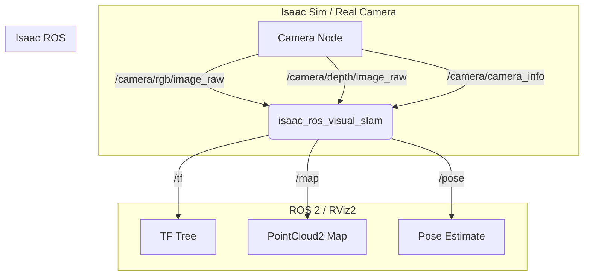
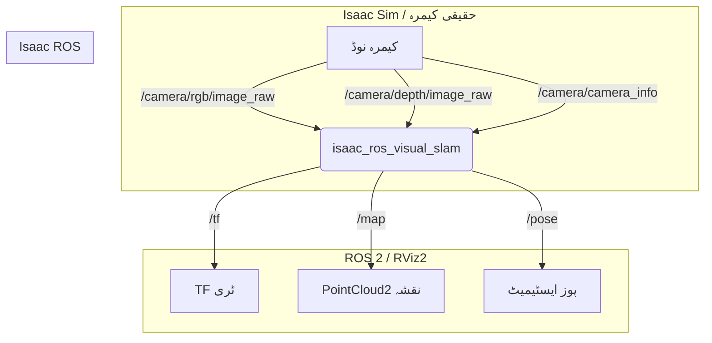

import Admonition from '@theme/Admonition';
import LanguageToggle from '@site/src/components/LanguageToggle/LanguageToggle';

<LanguageToggle />


<div className="english-content">

# Chapter 12: The Seeing Eye (Hardware-Accelerated VSLAM)

A brain is useless without senses. In this mission, you will give your robot the ability to simultaneously **build a map of its environment and track its own position within it**—a process known as Visual SLAM (Simultaneous Localization and Mapping). You will implement a state-of-the-art VSLAM system using **Isaac ROS**, leveraging your GPU to achieve real-time performance that would be impossible on a CPU alone.

### Key Learning Objectives

*   Understand and implement a full Visual SLAM pipeline.
*   Integrate and configure hardware-accelerated ROS 2 packages ("Gems").
*   Analyze and benchmark the performance difference between CPU and GPU-based robotics algorithms.

## 12.1 — Why Hardware Acceleration is a Game-Changer

Traditional robotics algorithms, especially in perception, often run on the CPU. However, processing high-volume data streams like 60 FPS camera feeds is computationally intensive. A CPU can quickly become a bottleneck, leading to delayed or dropped measurements and, ultimately, a lost and confused robot.

By offloading these parallelizable tasks to a GPU, we can process data much faster, leading to more accurate and robust real-time performance. This is the core principle of the Isaac ROS stack.

### The Isaac ROS VSLAM Gem

NVIDIA provides a suite of hardware-accelerated ROS 2 packages called "Gems." The `isaac_ros_visual_slam` package is a standout example. It takes in synchronized RGB-D camera data and outputs the robot's real-time pose estimate and a map of the environment.

### VSLAM ROS 2 Graph

The data flow is a pipeline of nodes communicating over topics. Your camera node (from Isaac Sim or a real camera) publishes images, the VSLAM node consumes them, and RViz2 visualizes the outputs.



## 12.2 — Mission 2: Building the Map

Let's implement the VSLAM pipeline.

### 1. Launching the VSLAM Node

You will create a ROS 2 launch file to start the `isaac_ros_visual_slam` node and remap the topics to match your camera's output.

```python title="launch/vslam.launch.py"
import os
from launch import LaunchDescription
from launch_ros.actions import Node
from launch.actions import DeclareLaunchArgument
from launch.substitutions import LaunchConfiguration

def generate_launch_description():
    # Declare launch arguments for remapping
    rgb_topic = LaunchConfiguration('rgb_topic', default='/camera/rgb/image_raw')
    depth_topic = LaunchConfiguration('depth_topic', default='/camera/depth/image_raw')
    camera_info_topic = LaunchConfiguration('camera_info_topic', default='/camera/camera_info')

    return LaunchDescription([
        DeclareLaunchArgument('rgb_topic', default_value=rgb_topic),
        DeclareLaunchArgument('depth_topic', default_value=depth_topic),
        DeclareLaunchArgument('camera_info_topic', default_value=camera_info_topic),
        
        Node(
            package='isaac_ros_visual_slam',
            executable='isaac_ros_visual_slam',
            name='visual_slam_node',
            output='screen',
            parameters=[{
                'use_sim_time': True,
                # Add other VSLAM parameters here from a YAML file
            }],
            remappings=[
                ('stereo_camera/left/image', rgb_topic),
                ('stereo_camera/left/camera_info', camera_info_topic),
                ('stereo_camera/depth', depth_topic)
            ]
        )
    ])
```

<Admonition type="tip" title="Personalization Tip">
  To use this with your own robot, you simply need to change the `default` values of the `rgb_topic`, `depth_topic`, and `camera_info_topic` to match the topics your robot's camera publishes.
</Admonition>

### 2. Visualizing in RViz2

To see the results, you will configure RViz2:
1.  Set the "Global Options" `Fixed Frame` to `odom`.
2.  Add the `TF` display to see the robot's pose tree.
3.  Add a `PointCloud2` display and set the topic to `/map` to see the map being built.
4.  Add a `Pose` display and set the topic to `/pose` to see the current pose estimate.

As you drive your robot around in Isaac Sim, you should see the map grow in RViz2 in real-time.

## 12.3 — Hardware Focus: The CPU vs. GPU Showdown

This exercise will give you a visceral understanding of hardware acceleration.

1.  **Run CPU-based SLAM:** First, launch a well-known CPU-based SLAM package like `rtabmap_ros`. While it runs, open a terminal and run `htop`. You will see several of your CPU cores spike to 80-100% utilization.
2.  **Run Isaac ROS VSLAM:** Now, stop the CPU SLAM and launch your `vslam.launch.py` file. While it's running, open two terminals:
    *   In the first, run `htop`. You will notice your CPU usage is significantly lower.
    *   In the second, run `watch -n 1 nvidia-smi`. You will see the `isaac_ros_visual_slam` process appear and GPU utilization climb.

**Conclusion:** The `isaac_ros_visual_slam` node offloads the heavy computation to the **CUDA cores on your RTX 4070 Ti**, freeing up the CPU for other critical tasks like path planning or running AI models. This is the power of a hardware-accelerated robotics stack.


</div>

<div className="urdu-content">


# باب 12: دیکھنے والا آنکھ (ہارڈویئر-تیز کردہ VSLAM)

بغیر حواس کے دماغ کا کوئی فائدہ نہیں۔ اس مشن میں، آپ اپنے روبوٹ کو یک وقت میں **اپنے ماحول کا ایک نقشہ بنانے اور اس کے اندر اپنی جگہ کا ٹریک رکھنے** کی صلاحیت دیں گے—ایک عمل جسے ویژول SLAM (ہم آہنگ مقامیت اور نقشہ کشی) کہا جاتا ہے۔ آپ **Isaac ROS** کا استعمال کرتے ہوئے ایک جدید VSLAM سسٹم نافذ کریں گے، اپنے GPU کو لے کر حقیقی وقت کی کارکردگی حاصل کرنے کے لیے جو CPU کے ساتھ ممکن نہیں ہو سکتی۔

### کلیدی سیکھنے کے اہداف

*   ایک مکمل ویژول SLAM پائپ لائن کو سمجھنا اور نافذ کرنا۔
*   ہارڈویئر-تیز کردہ ROS 2 پیکجز ("جیمز") کو انضمام اور کنفیگر کرنا۔
*   CPU اور GPU-مبنی روبوٹکس الگورتھم کے درمیان کارکردگی کا تجزیہ اور بینچ مارک کرنا۔

## 12.1 — ہارڈویئر تیزی کیوں ایک گیم چینجر ہے

روایتی روبوٹکس الگورتھم، خاص طور پر ادراک میں، اکثر CPU پر چلتے ہیں۔ تاہم، 60 FPS کیمرہ فیڈز جیسے زیادہ والیم والے ڈیٹا سٹریمز کی پروسیسنگ کمپیوٹیشنل طور پر بہت مہنگی ہے۔ CPU جلد ہی ایک رکاوٹ بن سکتا ہے، جس کے نتیجے میں تاخیر یا چھوٹے گئے پیمائش ہو سکتے ہیں اور آخر میں، ایک کھویا ہوا اور الجھا ہوا روبوٹ۔

GPU پر ان متوازی کاموں کو ٹال کر، ہم ڈیٹا کو بہت تیزی سے پروسیس کر سکتے ہیں، جس سے زیادہ درست اور مضبوط حقیقی وقت کی کارکردگی حاصل ہوتی ہے۔ یہ Isaac ROS اسٹیک کا بنیادی اصول ہے۔

### Isaac ROS VSLAM جیم

NVIDIA ہارڈویئر-تیز کردہ ROS 2 پیکجز کا ایک مجموعہ فراہم کرتا ہے جسے "جیمز" کہا جاتا ہے۔ `isaac_ros_visual_slam` پیکج ایک نمایاں مثال ہے۔ یہ ہم وقت سے مطابقت رکھنے والے RGB-D کیمرہ ڈیٹا کو قبول کرتا ہے اور روبوٹ کی حقیقی وقت کی پوز ایسٹیمیٹ اور ماحول کا نقشہ پیدا کرتا ہے۔

### VSLAM ROS 2 گراف

ڈیٹا کا بہاؤ ٹاپکس پر رابطہ کرنے والے نوڈس کی ایک پائپ لائن ہے۔ آپ کا کیمرہ نوڈ (Isaac Sim یا ایک حقیقی کیمرہ سے) امیجز پبلش کرتا ہے، VSLAM نوڈ انہیں استعمال کرتا ہے، اور RViz2 آؤٹ پٹس کو ویژولائز کرتا ہے۔



## 12.2 — مشن 2: نقشہ کی تعمیر

چلو VSLAM پائپ لائن کو نافذ کریں۔

### 1. VSLAM نوڈ کو لانچ کرنا

آپ ایک ROS 2 لانچ فائل تخلیق کریں گے تاکہ `isaac_ros_visual_slam` نوڈ شروع کیا جا سکے اور ٹاپکس کو دوبارہ میپ کیا جا سکے تاکہ آپ کے کیمرہ کے آؤٹ پٹ کے مطابق ہو سکے۔

```python title="launch/vslam.launch.py"
import os
from launch import LaunchDescription
from launch_ros.actions import Node
from launch.actions import DeclareLaunchArgument
from launch.substitutions import LaunchConfiguration

def generate_launch_description():
    # ری میپ کرنے کے لیے لانچ آرگومنٹس کا اعلان کریں
    rgb_topic = LaunchConfiguration('rgb_topic', default='/camera/rgb/image_raw')
    depth_topic = LaunchConfiguration('depth_topic', default='/camera/depth/image_raw')
    camera_info_topic = LaunchConfiguration('camera_info_topic', default='/camera/camera_info')

    return LaunchDescription([
        DeclareLaunchArgument('rgb_topic', default_value=rgb_topic),
        DeclareLaunchArgument('depth_topic', default_value=depth_topic),
        DeclareLaunchArgument('camera_info_topic', default_value=camera_info_topic),

        Node(
            package='isaac_ros_visual_slam',
            executable='isaac_ros_visual_slam',
            name='visual_slam_node',
            output='screen',
            parameters=[{
                'use_sim_time': True,
                # دیگر VSLAM پیرامیٹرز کو YAML فائل سے یہاں شامل کریں
            }],
            remappings=[
                ('stereo_camera/left/image', rgb_topic),
                ('stereo_camera/left/camera_info', camera_info_topic),
                ('stereo_camera/depth', depth_topic)
            ]
        )
    ])
```

<Admonition type="tip" title="ذاتی کارکردگی کا مشورہ">
  اسے اپنے اپنے روبوٹ کے ساتھ استعمال کرنے کے لیے، آپ کو صرف `rgb_topic`، `depth_topic`، اور `camera_info_topic` کے `default` ویلیوز کو تبدیل کرنا ہوگا تاکہ آپ کے روبوٹ کے کیمرہ کے پبلش کردہ ٹاپکس سے مطابقت رکھ سکے۔
</Admonition>

### 2. RViz2 میں ویژولائزیشن

نتائج دیکھنے کے لیے، آپ RViz2 کو کنفیگر کریں گے:
1.  "گلوبل آپشنز" `Fixed Frame` کو `odom` پر سیٹ کریں۔
2.  روبوٹ کی پوز ٹری دیکھنے کے لیے `TF` ڈسپلے شامل کریں۔
3.  ایک `PointCloud2` ڈسپلے شامل کریں اور ٹاپک کو `/map` پر سیٹ کریں تاکہ تعمیر ہونے والے نقشہ کو دیکھا جا سکے۔
4.  ایک `Pose` ڈسپلے شامل کریں اور ٹاپک کو `/pose` پر سیٹ کریں تاکہ موجودہ پوز ایسٹیمیٹ دیکھا جا سکے۔

جیسے جیسے آپ Isaac Sim میں اپنے روبوٹ کو چلائیں گے، آپ کو RViz2 میں حقیقی وقت میں نقشہ بڑھتے ہوئے نظر آنا چاہیے۔

## 12.3 — ہارڈویئر فوکس: CPU بمقابلہ GPU شو ڈاؤن

یہ مشق آپ کو ہارڈویئر تیزی کی جھلک دے گی۔

1.  **CPU-مبنی SLAM چلائیں:** سب سے پہل، `rtabmap_ros` جیسے ایک معروف CPU-مبنی SLAM پیکج لانچ کریں۔ جب یہ چل رہا ہو، ایک ٹرمنل کھولیں اور `htop` چلائیں۔ آپ دیکھیں گے کہ آپ کے کئی CPU کورز 80-100% استعمال تک بڑھ جائیں گے۔
2.  **Isaac ROS VSLAM چلائیں:** اب، CPU SLAM کو روکیں اور اپنی `vslam.launch.py` فائل لانچ کریں۔ جب یہ چل رہا ہو، دو ٹرمنلز کھولیں:
    *   پہلے میں، `htop` چلائیں۔ آپ نوٹ کریں گے کہ آپ کا CPU استعمال کافی کم ہے۔
    *   دوسرے میں، `watch -n 1 nvidia-smi` چلائیں۔ آپ دیکھیں گے کہ `isaac_ros_visual_slam` عمل ظاہر ہوتا ہے اور GPU استعمال بڑھ جاتا ہے۔

**نتیجہ:** `isaac_ros_visual_slam` نوڈ بھاری کمپیوٹیشن کو آپ کے RTX 4070 Ti پر **CUDA کورز** پر ٹالتا ہے، CPU کو دیگر اہم کاموں کے لیے آزاد کرتا ہے جیسے راستہ منصوبہ بندی یا AI ماڈلز چلانا۔ یہ ہارڈویئر-تیز کردہ روبوٹکس اسٹیک کی طاقت ہے۔

</div>
