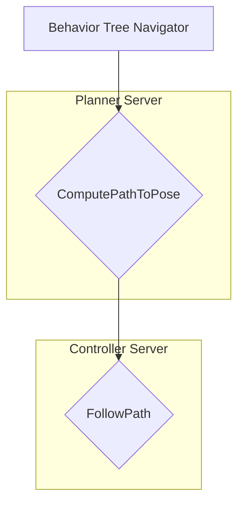
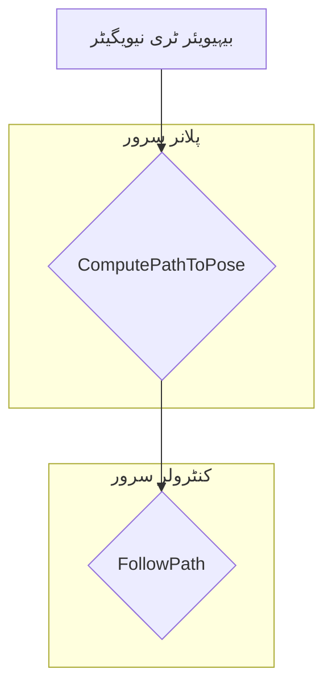

import Admonition from '@theme/Admonition';
import LanguageToggle from '@site/src/components/LanguageToggle/LanguageToggle';

<LanguageToggle />


<div className="english-content">

# Chapter 13: The Bipedal Navigator (Nav2 Adaptation) for Humanoids

Your robot can see and map its world. But can it move with purpose? This final, advanced mission challenges you to adapt the industry-standard navigation stack, **Nav2**, for a bipedal humanoid. You will learn why algorithms designed for wheeled robots fail for legged systems and implement a custom controller to bridge the gap between high-level planning and low-level walking.

### Key Learning Objectives

*   Critically analyze the limitations of standard navigation algorithms for legged robots.
*   Understand the detailed architecture of the Nav2 stack.
*   Develop and integrate a custom controller plugin for Nav2.

## 13.1 — Wheeled vs. Legged: A Tale of Two Robots

The default Nav2 stack is brilliant... for robots with wheels. It assumes the robot is a "kinematic car" that can be controlled by a `geometry_msgs/Twist` message, which specifies linear (forward/backward) and angular (turning) velocities.

**This assumption breaks down for a humanoid:**
*   A humanoid cannot move at any arbitrary `(x, y, z)` velocity. It moves in discrete steps.
*   Turning is not instantaneous; it requires a sequence of steps.
*   The robot's "footprint" is not a static circle or square; it's a dynamic shape that changes with every step.

Sending a `cmd_vel` to a walking controller is like telling a person "move forward at 1.5 m/s and turn at 0.4 rad/s." This is unnatural. We need to command the robot in a way it understands: by telling it where to step.

## 13.2 — Deconstructing the Nav2 Stack

To modify Nav2, we must first understand its architecture. Nav2 is a highly modular system managed by a Behavior Tree. For our purposes, the most important part is the **Controller Server**.



The `FollowPath` behavior is where the magic happens. It takes the global path from the Planner and passes it to a selected **Controller Plugin**. The default plugin (e.g., DWB) calculates a `cmd_vel`. Our mission is to replace this plugin.

### The Planner/Controller Workflow

This is the core loop of Nav2's `FollowPath` behavior.

```
+--------------------------+
|  Global Path from Planner|
|  (e.g., A* or Smac)      |
+-------------+------------+
              |
              v
+-------------+------------+
|   Controller Server      |
| (FollowPath Behavior)    |
+-------------+------------+
              |
              v
+-------------+------------+
|   Custom Bipedal         |
|   Controller Plugin      |
|                          |
| 1. Receives global path. |
| 2. Finds its current pose.|
| 3. Computes the *next*   |
|    logical step to take. |
+-------------+------------+
              |
              v
+-------------+------------+
|  Publishes Custom Msg    |
| (humanoid_nav_msgs/Step) |
+--------------------------+
              |
              v
+--------------------------+
|  Low-Level Walking       |
|  Controller (Future Mod.)|
+--------------------------+

```

## 13.3 Mission 3: Building a Custom Bipedal Controller

We will create a simplified controller in Python that publishes custom "step" commands instead of `cmd_vel`.

### 1. Define the Command Message

First, we create a new message package (`humanoid_nav_msgs`) with a `StepCommand.msg` file.

```ros2-msg title="humanoid_nav_msgs/msg/StepCommand.msg"
# A command to take one or more steps
string command_id   # e.g., "forward", "turn_left", "strafe_right"
uint32 number_of_steps
```

### 2. The Python Controller Plugin

This Python class will be registered as a Nav2 plugin. It receives the global path and computes a very simple command.

```python title="bipedal_controller/controller.py"
import rclpy
from nav2_core.controller import Controller
from humanoid_nav_msgs.msg import StepCommand

class BipedalController(Controller):
    def configure(self, parent, name, tf, costmap_ros):
        # Initialize the node and publisher
        self._node = parent
        self._plugin_name = name
        self._publisher = self._node.create_publisher(StepCommand, "/bipedal_step_command", 10)
        # ... other initializations ...

    def setPlan(self, path):
        # Store the path received from the planner
        self._global_plan = path

    def computeVelocityCommands(self, pose, velocity, goal_checker):
        # This is the main loop
        # For simplicity, we'll just look at the next point on the path
        # and issue a "forward" command if it's far enough away.
        # A real controller would be much more complex.

        if self._is_goal_reached():
            return None # Stop

        step_msg = StepCommand()
        step_msg.command_id = "forward"
        step_msg.number_of_steps = 1
        
        self._publisher.publish(step_msg)

        # We don't return a Twist, as we're not a velocity-based controller
        return None 
```

### 3. Configuration and Registration

**a) Register the Plugin:** You modify `setup.py` in your Python package to register `bipedal_controller.controller:BipedalController` as a `nav2_core.controller` plugin.

**b) Configure Nav2:** You create a YAML file telling Nav2's controller server to use your new plugin.

```yaml title="nav2_params.yaml"
controller_server:
  ros__parameters:
    use_sim_time: True
    controller_plugins: ["FollowPath"]
    FollowPath:
      plugin: "your_ros2_pkg::BipedalController" # The name you registered
      # ... other parameters for your plugin ...
```

When you launch Nav2 with this configuration, clicking a goal in RViz will cause your `BipedalController` to be called, and you'll see `StepCommand` messages being published.

<Admonition type="caution" icon="⚙️" title="Hardware Focus: CPU is King for Planning">
  While VSLAM leaned on the GPU, path planning is a different story. The algorithms used by Nav2's planners (like Smac Planner, which uses A*) are sequential and CPU-bound. A high-core-count CPU with good single-threaded performance is critical for reducing the time it takes to compute a complex global path. You can use tools like `gprof` or even simple timing logs within the C++ source code of Nav2 to profile and understand which planning heuristics are most expensive.
</Admonition>


</div>

<div className="urdu-content">


# باب 13: بائی پیڈل نیویگیٹر (Nav2 ایڈاپٹیشن) ہیومنوائڈز کے لیے

آپ کا روبوٹ اپنی دنیا کو دیکھ سکتا ہے اور نقشہ بنا سکتا ہے۔ لیکن کیا یہ مقصد کے ساتھ حرکت کر سکتا ہے؟ یہ آخری، اعلیٰ درجے کا مشن آپ کو صنعتی معیار کے نیویگیشن اسٹیک، **Nav2**، کو بائی پیڈل ہیومنوائڈ کے لیے ایڈاپٹ کرنے کا چیلنج دیتا ہے۔ آپ سیکھیں گے کہ رولنگ والے روبوٹس کے لیے ڈیزائن کردہ الگورتھم لیگڈ سسٹم کے لیے کیوں ناکام ہوتے ہیں اور اعلیٰ درجے کی منصوبہ بندی اور کم درجے کی چلنے کے درمیان خلاء کو پُر کرنے کے لیے ایک حسب ضرورت کنٹرولر نافذ کریں گے۔

### کلیدی سیکھنے کے اہداف

*   لیگڈ روبوٹس کے لیے معیاری نیویگیشن الگورتھم کی حدود کا ناقدانہ تجزیہ کرنا۔
*   Nav2 اسٹیک کی تفصیلی معماری کو سمجھنا۔
*   Nav2 کے لیے ایک حسب ضرورت کنٹرولر پلگ ان تیار کرنا اور انضمام دینا۔

## 13.1 — چکروں والے بمقابلہ لیگز والے: دو روبوٹس کی کہانی

Nav2 اسٹیک کا ڈیفالٹ ورژن بہت شاندار ہے... چکروں والے روبوٹس کے لیے۔ یہ فرض کرتا ہے کہ روبوٹ ایک "کنیمیٹک کار" ہے جسے ایک `geometry_msgs/Twist` میسج کے ذریعے کنٹرول کیا جا سکتا ہے، جو لکیری (آگے/پیچھے) اور زاویہ (موڑنے) کی ویلوسٹیز کی وضاحت کرتا ہے۔

**ہیومنوائڈ کے لیے یہ فرضیات ناکام ہو جاتے ہیں:**
*   ہیومنوائڈ کو کسی بھی مرضی کی `(x, y, z)` ویلوسٹی پر حرکت نہیں کر سکتا۔ یہ مطابقت کے قدم میں حرکت کرتا ہے۔
*   موڑنا فوری نہیں ہے؛ اس کے لیے قدم کی ایک ترتیب کی ضرورت ہوتی ہے۔
*   روبوٹ کا "فُٹ پرنٹ" ایک مسلسل سرکل یا اسکوائر نہیں ہے؛ یہ ایک متحرک شکل ہے جو ہر قدم کے ساتھ تبدیل ہوتی ہے۔

چلنے والے کنٹرولر کو `cmd_vel` بھیجنا اس کی طرح ہے جیسے ایک شخص کو کہنا "1.5 میٹر/سیکنڈ پر آگے بڑھو اور 0.4 ریڈ/سیکنڈ پر موڑو۔" یہ غیر قدرتی ہے۔ ہمیں روبوٹ کو اس طرح کمانڈ دینی چاہیے جسے یہ سمجھ سکے: اسے بتا کر کہ قدم کہاں رکھنا ہے۔

## 13.2 — Nav2 اسٹیک کو توڑنا

Nav2 کو تبدیل کرنے کے لیے، ہمیں سب سے پہلے اس کی معماری کو سمجھنا ہوگا۔ Nav2 ایک انتہائی ماڈولر سسٹم ہے جو ایک بیہیویئر ٹری کے ذریعے منظم کیا جاتا ہے۔ ہمارے مقاصد کے لیے، سب سے اہم حصہ **کنٹرولر سرور** ہے۔



`FollowPath` بیہیوئر وہ جگہ ہے جہاں جادو ہوتا ہے۔ یہ پلانر سے گلوبل پاتھ لیتا ہے اور اسے منتخب کردہ **کنٹرولر پلگ ان** کو پاس کرتا ہے۔ ڈیفالٹ پلگ ان (مثلاً DWB) ایک `cmd_vel` کا حساب لگاتا ہے۔ ہمارا مشن اس پلگ ان کو تبدیل کرنا ہے۔

### پلانر/کنٹرولر ورک فلو

یہ Nav2 کے `FollowPath` بیہیوئر کا بنیادی لوپ ہے۔

```
+--------------------------+
|  گلوبل پاتھ پلانر سے   |
|  (مثلاً، A* یا Smac)    |
+-------------+------------+
              |
              v
+-------------+------------+
|   کنٹرولر سرور          |
| (FollowPath بیہیوئر)    |
+-------------+------------+
              |
              v
+-------------+------------+
|   حسب ضرورت بائی پیڈل  |
|   کنٹرولر پلگ ان        |
|                          |
| 1. گلوبل پاتھ وصول کرتا ہے۔ |
| 2. اس کی موجودہ پوز تلاش کرتا ہے۔|
| 3. اگلا منطقی قدم لینے کا حساب لگاتا ہے۔ |
+-------------+------------+
              |
              v
+-------------+------------+
|  حسب ضرورت میسج شائع کرتا ہے |
| (humanoid_nav_msgs/Step) |
+--------------------------+
              |
              v
+--------------------------+
|  کم درجے کا چلنے کا     |
|  کنٹرولر (مستقبل کا ماڈیول)|
+--------------------------+

```

## 13.3 مشن 3: ایک حسب ضرورت بائی پیڈل کنٹرولر تیار کرنا

ہم ایک سادہ کنٹرولر تخلیق کریں گے جو `cmd_vel` کے بجائے حسب ضرورت "قدم" کمانڈز شائع کرے گا۔

### 1. کمانڈ میسج کی وضاحت کریں

سب سے پہل، ہم ایک نیا میسج پیکج (`humanoid_nav_msgs`) تخلیق کریں گے جس میں ایک `StepCommand.msg` فائل ہوگی۔

```ros2-msg title="humanoid_nav_msgs/msg/StepCommand.msg"
# ایک یا زیادہ قدم اٹھانے کا کمانڈ
string command_id   # مثلاً، "forward"، "turn_left"، "strafe_right"
uint32 number_of_steps
```

### 2. پائی تھن کنٹرولر پلگ ان

یہ پائی تھن کلاس ایک Nav2 پلگ ان کے طور پر رجسٹر ہوگی۔ یہ گلوبل پاتھ وصول کرتا ہے اور ایک بہت سادہ کمانڈ کا حساب لگاتا ہے۔

```python title="bipedal_controller/controller.py"
import rclpy
from nav2_core.controller import Controller
from humanoid_nav_msgs.msg import StepCommand

class BipedalController(Controller):
    def configure(self, parent, name, tf, costmap_ros):
        # نوڈ اور پبلشر کو شروع کریں
        self._node = parent
        self._plugin_name = name
        self._publisher = self._node.create_publisher(StepCommand, "/bipedal_step_command", 10)
        # ... دیگر شروع کاری ...

    def setPlan(self, path):
        # پلانر سے وصول کردہ پاتھ کو ذخیرہ کریں
        self._global_plan = path

    def computeVelocityCommands(self, pose, velocity, goal_checker):
        # یہ اصل لوپ ہے
        # سادگی کے لیے، ہم صرف پاتھ پر اگلے پوائنٹ کو دیکھیں گے
        # اور اس کے فاصلے کے لیے "forward" کمانڈ جاری کریں گے۔
        # ایک حقیقی کنٹرولر بہت زیادہ پیچیدہ ہوگا۔

        if self._is_goal_reached():
            return None # روکیں

        step_msg = StepCommand()
        step_msg.command_id = "forward"
        step_msg.number_of_steps = 1

        self._publisher.publish(step_msg)

        # ہم Twist نہیں لوٹاتے، کیونکہ ہم ویلوسٹی-مبنی کنٹرولر نہیں ہیں
        return None
```

### 3. کنفیگریشن اور رجسٹریشن

**الف) پلگ ان کو رجسٹر کریں:** آپ اپنے پائی تھن پیکج میں `setup.py` کو تبدیل کر کے `bipedal_controller.controller:BipedalController` کو ایک `nav2_core.controller` پلگ ان کے طور پر رجسٹر کریں گے۔

**ب) Nav2 کو کنفیگر کریں:** آپ ایک YAML فائل تخلیق کریں گے جو Nav2 کے کنٹرولر سرور کو بتائے گی کہ آپ کے نئے پلگ ان کو استعمال کریں۔

```yaml title="nav2_params.yaml"
controller_server:
  ros__parameters:
    use_sim_time: True
    controller_plugins: ["FollowPath"]
    FollowPath:
      plugin: "your_ros2_pkg::BipedalController" # وہ نام جو آپ نے رجسٹر کیا
      # ... آپ کے پلگ ان کے لیے دیگر پیرامیٹرز ...
```

جب آپ اس کنفیگریشن کے ساتھ Nav2 لانچ کریں گے، RViz میں گوئل کلک کرنے سے آپ کا `BipedalController` کال ہوگا، اور آپ `StepCommand` میسجس کو شائع ہوتے ہوئے دیکھیں گے۔

<Admonition type="caution" icon="⚙️" title="ہارڈویئر فوکس: منصوبہ بندی کے لیے CPU بادشاہ ہے">
  جبکہ VSLAM GPU پر انحصار کرتا تھا، راستہ منصوبہ بندی ایک مختلف کہانی ہے۔ Nav2 کے پلانرز (جیسے Smac پلانر، جو A* استعمال کرتا ہے) کے ذریعے استعمال کردہ الگورتھم تسلسل پر مبنی اور CPU-bound ہیں۔ پیچیدہ گلوبل راستہ کے حساب کو کم کرنے کے لیے اچھی سنگل-تھریڈڈ کارکردگی کے ساتھ زیادہ کورز والے CPU کا ہونا انتہائی اہم ہے۔ آپ Nav2 کے C++ سورس کوڈ میں ٹائم کے لاگز یا `gprof` جیسے ٹولز کا استعمال کر کے یہ سمجھنے کے لیے پروفائل کر سکتے ہیں کہ منصوبہ بندی کے کون سے ہیورسٹک سب سے زیادہ مہنگے ہیں۔
</Admonition>

</div>
