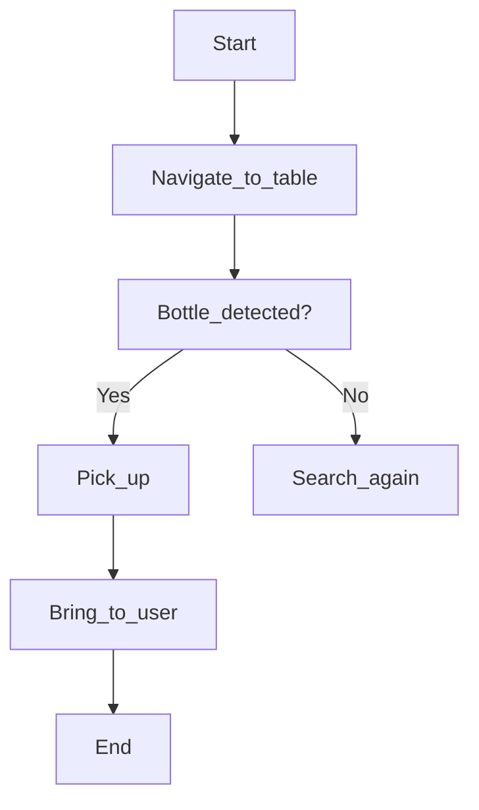

--- 
id: llm-cognitive-planning-and-vision
title: 'chapter 18: Cognitive Planning with LLMs & Vision Integration'
sidebar_position: 6
---

import Admonition from '@theme/Admonition';
import LanguageToggle from '@site/src/components/LanguageToggle/LanguageToggle';

<LanguageToggle />


<div className="english-content">

# chapter 18: Cognitive Planning with LLMs & Vision Integration

### Key Learning Objectives

*   Natural Language Understanding (NLU) using LLMs.
*   Cognitive planning, task decomposition, and error handling with LLMs.
*   Integrating a vision system for object detection and tracking.

## 18.1 — Natural Language Understanding (NLU)

After speech becomes text, the system must understand meaning.

### What Must Be Extracted from a Command?

From this sentence:

— Go to the table and bring the bottle—

We must extract:

| Element       | Extracted     |
| :------------ | :------------ |
| **Action**    | go, bring     |
| **Target object** | bottle        |
| **Location**  | table         |
| **Priority**  | normal        |
| **Safety risk** | low           |

### Using LLM (OpenAI / Local LLM) for Parsing

We send prompt to LLM:

```
Convert this into structured JSON:
"Go to the table and bring the bottle"
```

LLM returns:

```json
{
  "tasks": [
    {"action": "navigate", "target": "table"},
    {"action": "detect", "object": "bottle"},
    {"action": "pickup", "object": "bottle"},
    {"action": "bring", "destination": "user"}
  ]
}
```

This structure becomes your robot plan.


## 18.4 — Cognitive Planning using LLMs

This is where your robot thinks before acting.

### 1.18.1 Task Decomposition

Command:

Clean the room

Becomes:

*   Navigate to floor zones
*   Detect trash
*   Pick trash
*   Put in bin
*   Repeat

LLM helps break natural language into micro-tasks.

This is the same principle used in advanced AI Agents (AutoGPT / LangGraph / OpenAI Agents SDK).

### 1.18.2 Action Trees

Each task becomes a node in a decision tree:



This makes the robot logical and safe.

### 1.18.3 Error Handling & Re-planning

If:

*   Object not found
*   Path blocked
*   Arm fails

The robot executes fallback:

*   If bottle not found: rotate + scan + zoom + rescan
*   If blocked: replan route
*   If fail twice: ask human

This is called autonomous recovery — a feature of advanced robots.

---

## 18.3 — Vision System Integration

Now robot must see the object.

### Camera + ROS 2 Setup

ROS Topic Example:

/camera/image_raw

### Object Detection (YOLO / Detectron / OpenCV)

We use pretrained model:

```bash
pip install ultralytics opencv-python
```

Code logic:

```python
from ultralytics import YOLO
model = YOLO("yolov8n.pt")

results = model("image.jpg")
```

Then:

```json
{
  "object": "bottle",
  "confidence": 0.91
}
```

If bottle confidence > 85% → valid target

### Target Tracking

Once identified:

*   Robot head tracks target
*   Robot calculates distance
*   Robot aligns hand for grasp

This uses:

*   Depth camera
*   Bounding boxes
*   Distance estimation


</div>

<div className="urdu-content">


# باب 18: LLMs کے ساتھ شعوری منصوبہ بندی اور ویژن کا انضمام

### کلیدی سیکھنے کے اہداف

*   LLMs کا استعمال کرتے ہوئے قدرتی زبان کی سمجھ (NLU)۔
*   LLMs کے ساتھ شعوری منصوبہ بندی، کام کی تقسیم، اور خرابی کا انتظام۔
*   اوبجیکٹ ڈیٹیکشن اور ٹریکنگ کے لیے ایک ویژن سسٹم کا انضمام۔

## 18.1 — قدرتی زبان کی سمجھ (NLU)

تقریر کے ٹیکسٹ میں تبدیل ہونے کے بعد، سسٹم کو معنی کو سمجھنا چاہیے۔

### کمانڈ سے کیا نکالنا ضروری ہے؟

اس جملے سے:

— میز پر جاؤ اور بوتل لے آؤ—

ہمیں یہ نکالنا چاہیے:

| عنصر | نکالا گیا |
| :------------ | :------------ |
| **ایکشن** | جانا، لانا |
| **ہدف اوبجیکٹ** | بوتل |
| **مقام** | میز |
| **اہمیت** | عام |
| **حصانیت کا خطرہ** | کم |

### تشریح کے لیے LLM (OpenAI / مقامی LLM) کا استعمال

ہم LLM کو یہ پروموٹ بھیجتے ہیں:

```
اسے ساختہ JSON میں تبدیل کریں:
"میز پر جاؤ اور بوتل لے آؤ"
```

LLM یہ لوٹاتا ہے:

```json
{
  "tasks": [
    {"action": "navigate", "target": "table"},
    {"action": "detect", "object": "bottle"},
    {"action": "pickup", "object": "bottle"},
    {"action": "bring", "destination": "user"}
  ]
}
```

یہ ساخت آپ کا روبوٹ منصوبہ بن جاتا ہے۔

## 18.4 — LLMs کا استعمال کرتے ہوئے شعوری منصوبہ بندی

یہ وہ جگہ ہے جہاں آپ کا روبوٹ کارروائی سے پہلے سوچتا ہے۔

### 1.18.1 کام کی تقسیم

کمانڈ:

کمرہ صاف کریں

بن جاتا ہے:

*   فرش کے زونز پر جائیں
*   کچرا ڈیٹیکٹ کریں
*   کچرا اٹھائیں
*   بین میں ڈالیں
*   دہرائیں

LLM قدرتی زبان کو مائیکرو ٹاسکس میں توڑنے میں مدد کرتا ہے۔

یہی اصول جدید AI ایجنٹس (AutoGPT / LangGraph / OpenAI Agents SDK) میں استعمال ہوتا ہے۔

### 1.18.2 ایکشن ٹریز

ہر کام ایک فیصلہ کے درخت میں ایک نوڈ بن جاتا ہے:


یہ روبوٹ کو منطقی اور محفوظ بنا دیتا ہے۔

### 1.18.3 خرابی کا انتظام اور دوبارہ منصوبہ بندی

اگر:

*   اوبجیکٹ نہیں ملا
*   راستہ مسدود ہے
*   آرم ناکام ہوتا ہے

تو روبوٹ فیل بیک چلاتا ہے:

*   اگر بوتل نہیں ملی: گھومیں + اسکین کریں + زوم + دوبارہ اسکین کریں
*   اگر مسدود ہے: راستہ دوبارہ منصوبہ بند کریں
*   اگر دو بار ناکام ہوتا ہے: انسان سے پوچھیں

اسے خود مختار بازیافت کہا جاتا ہے — جدید روبوٹس کی ایک خصوصیت۔

---

## 18.3 — ویژن سسٹم کا انضمام

اب روبوٹ کو اوبجیکٹ دیکھنا چاہیے۔

### کیمرہ + ROS 2 سیٹ اپ

ROS ٹاپک کی مثال:

/camera/image_raw

### اوبجیکٹ ڈیٹیکشن (YOLO / Detectron / OpenCV)

ہم پہلے سے تربیت یافتہ ماڈل استعمال کرتے ہیں:

```bash
pip install ultralytics opencv-python
```

کوڈ منطق:

```python
from ultralytics import YOLO
model = YOLO("yolov8n.pt")

results = model("image.jpg")
```

پھر:

```json
{
  "object": "bottle",
  "confidence": 0.91
}
```

اگر بوتل کا یقین > 85% → درست ہدف

### ہدف ٹریکنگ

ایک بار شناخت ہونے کے بعد:

*   روبوٹ کا سر ہدف کو ٹریک کرتا ہے
*   روبوٹ فاصلہ کا حساب لگاتا ہے
*   روبوٹ گریسنگ کے لیے ہاتھ کو ہدف سے مطابقت دیتا ہے

اس میں استعمال ہوتا ہے:

*   ڈیپتھ کیمرہ
*   باؤنڈنگ باکسز
*   فاصلہ کا تخمینہ

</div>
